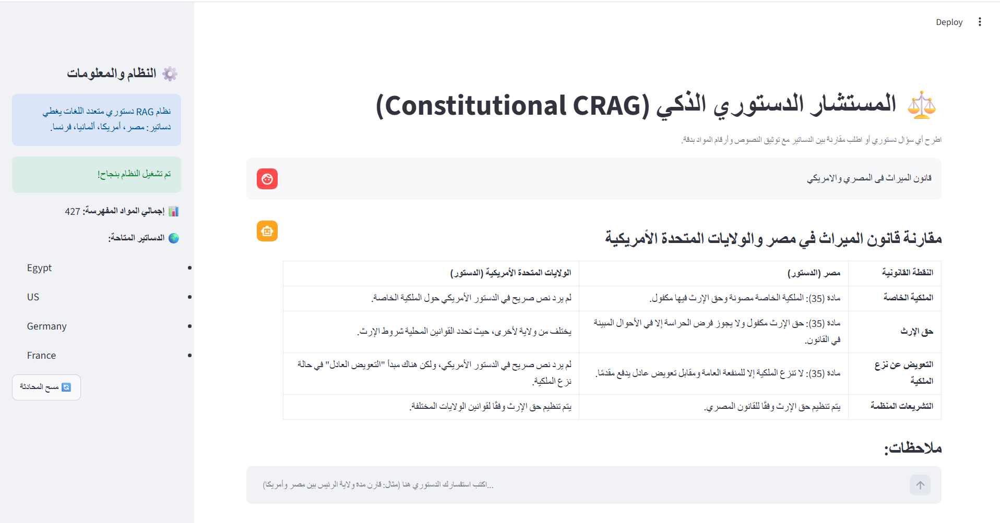

# 🏛️ Constitutional Multilingual RAG System

نظام متقدم متعدد اللغات للاسترجاع والتوليد المعزز بالاسترجاع (**Corrective RAG - CRAG**) مبني بالكامل باستخدام **LangChain** لإجراء المقارنات والاستفسارات القانونية بدقة استناداً إلى دساتير أربع دول: **مصر، الولايات المتحدة الأمريكية، ألمانيا، وفرنسا**.

---

## 📌 الميزات الرئيسية (Key Features)

- **معمارية مرنة ومجردة (Generic & Modular Architecture):** دعم كامل للتبديل بين نماذج التوليد (OpenAI, Ollama) ونماذج التضمين المتعددة اللغات (OpenAI, HuggingFace) عبر ملف إعدادات مركزي.
- **تقطيع قانوني دقيق (Constitutional Chunking):** استخراج وتقطيع نصوص الدساتير إلى وحدات دستورية (مواد وأبواب) مع إثراء كل قطعة ببيانات وصفية (Metadata): الدولة، اللغة، رقم المادة، ومصدر المستند.
- **محرك بحث هجين (Hybrid Search Engine):** دمج البحث الدلالي (Dense Vector Similarity) مع البحث اللفظي الحرفي (BM25 Sparse Search) لمطابقة المصطلحات القانونية وأرقام المواد الدستورية بدقة.
- **استرجاع تصحيحي حتمي (Deterministic CRAG Pipeline):** فحص مدى صلة وكفاية الوثائق المسترجعة بالسؤال عبر LCEL، وتفعيل إعادة الصياغة وإعادة الاسترجاع التصحيحي في حال عدم الصلة، دون الحاجة إلى تشغيل عميل مستقل (Agent loop).
- **توليد صارم موثق (Hallucination-free Generation):** إلزام النموذج القانوني بذكر اسم الدولة ورقم المادة المرجعية لكل نقطة، ومنعه من اختلاق أي نصوص غير واردة في السياق المسترجع.

---

## 📁 هيكل المشروع (Project Structure)

```text
constitutional_rag_project/
├── config/
│   └── settings.yaml            # إعدادات النماذج، الأوزان، ومسار قاعدة المتجهات
├── data/
│   └── raw/                     # ملفات PDF لدساتير الدول الأربع
├── src/
│   ├── core/
│   │   ├── config.py            # قراءة الإعدادات باستخدام Pydantic
│   │   └── factories.py         # مصانع الـ Models / Embeddings / VectorStore
│   ├── ingestion/
│   │   └── legal_parser.py      # تجزئة الدساتير واستخراج الميتاداتا
│   ├── retrieval/
│   │   └── hybrid_engine.py     # محرك البحث الهجين (Dense + BM25)
│   └── pipeline/
│       ├── prompts.py           # قوالب التقييم والترجمة والتوليد
│       └── crag_pipeline.py     # خط سير العمل الحتمي (LCEL)
├── main.py                      # نقطة الدخول الرئيسية للتشغيل
├── requirements.txt             # متطلبات المشروع البرمجية
├── .env.example                 # نموذج مفاتيح الربط
└── README.md
```  

---

## 🖼️ مثال توضيحي (Example)

 